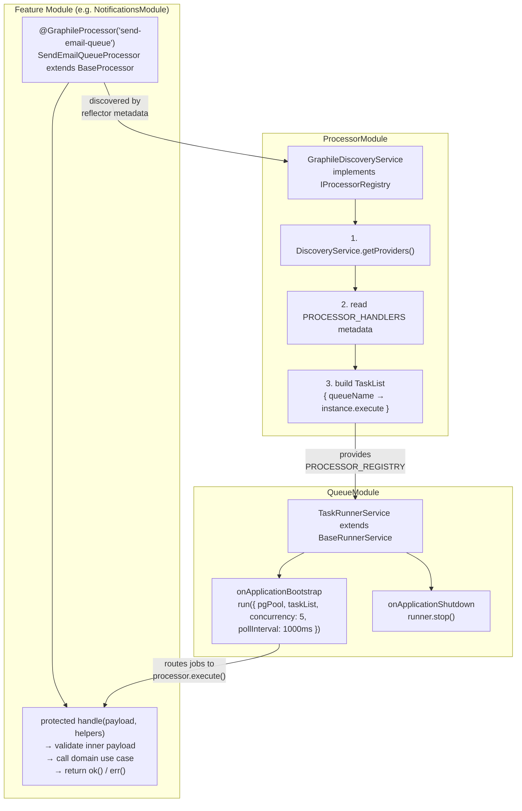
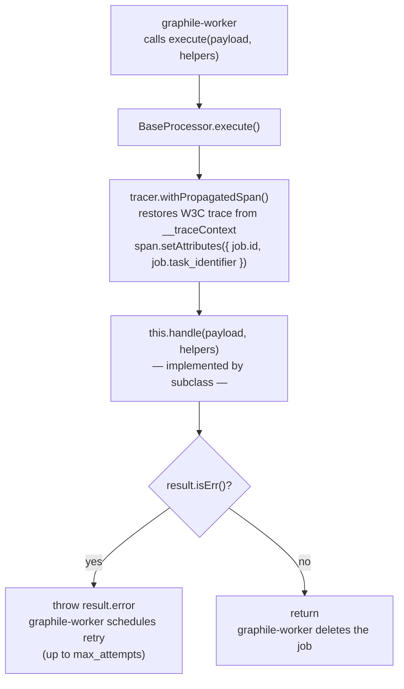
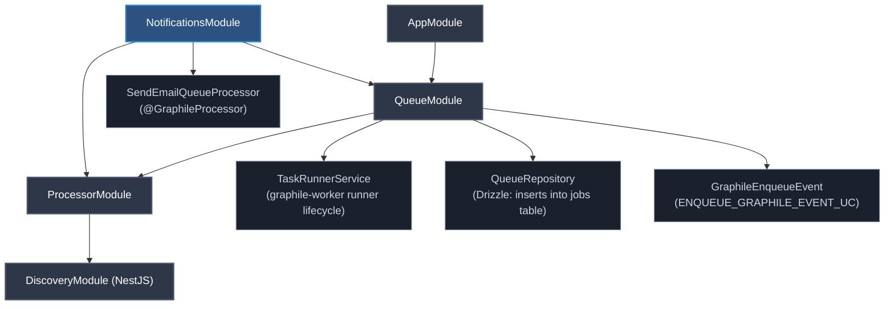

# `@core/processor` — Graphile Worker Infrastructure

This module provides the shared plumbing that connects **graphile-worker** to NestJS:
processor discovery, task registration, trace propagation, and lifecycle management.
Feature modules consume it by decorating their processors and importing `ProcessorModule`.

---

## Architecture Overview



---

## Key Concepts

### 1. `EventPayload` — The Graphile Job Envelope

Every job in `graphile_worker.jobs` is stored as an `EventPayload` JSON blob.
**It is not feature-specific** — it is the generic envelope that graphile passes
to every processor, regardless of which module enqueued the job.

```ts
interface EventPayload {
  eventId:        string;                         // unique job instance UUID
  eventType:      string;                         // e.g. "notification.send-email"
  queueName:      string;                         // matches the processor's queue name
  payload:        Record<string, unknown>;         // ← feature-specific data lives here
  __traceContext?: Record<string, string>;         // W3C trace propagation context
}
```

**Rule:** Processors must always re-validate `envelope.payload` against their
own domain schema at runtime. The outer `EventPayload` type only guarantees the
envelope shape, not the inner data.

---

### 2. `@GraphileProcessor(queueName)` — Registering a Processor

Decorating a class with `@GraphileProcessor` sets NestJS reflector metadata
(`PROCESSOR_HANDLERS`) on the class. During `onModuleInit`, `GraphileDiscoveryService`
reads this metadata from every NestJS provider and maps `queueName → instance.execute`.

```ts
@GraphileProcessor(SEND_EMAIL_QUEUE)   // 'send-email-queue'
export class SendEmailQueueProcessor extends BaseProcessor<EventPayload> {
  protected async handle(payload: EventPayload, helpers?: JobHelpers): Promise<Result<void, Error>> {
    // 1. validate inner payload
    // 2. call domain use case
    // 3. return ok() or err()
  }
}
```

**Constraints enforced at startup (fail-fast):**
- Each `queueName` must be globally unique — duplicate registrations crash the process.
- The decorated class must extend `BaseProcessor` — violators crash the process.

---

### 3. `BaseProcessor<TPayload>` — The Processor Base Class

`BaseProcessor` provides the public `execute()` method called by graphile-worker.
Feature processors implement only the protected `handle()` method.



**Return values from `handle()`:**
| Return | Effect |
|---|---|
| `ok()` | Job marked successful, deleted from queue |
| `err(e)` | Throws `e` — graphile-worker schedules a retry (up to `max_attempts`) |

---

### 4. `GraphileDiscoveryService` — Processor Registry

Implements `IProcessorRegistry`. Runs during `onModuleInit` and builds the
`TaskList` that graphile-worker uses to route jobs.

**Discovery flow:**
1. Calls `DiscoveryService.getProviders()` — NestJS built-in.
2. For each provider with `PROCESSOR_HANDLERS` metadata → reads the `queueName`.
3. Validates uniqueness and `instanceof BaseProcessor`.
4. Registers `taskList[queueName] = (payload, helpers) => instance.execute(payload, helpers)`.
5. Reports discovered count in an OTel span (`worker.discovery.count`).

**Fail-fast guarantee:** Any misconfiguration (duplicate queue, wrong base class) throws
via `process.nextTick(() => { throw err })`, which promotes the failure to an uncaught
exception, crashing the process before it starts accepting traffic.

---

### 5. `BaseRunnerService` — Lifecycle Management

`TaskRunnerService` (in `QueueModule`) extends `BaseRunnerService`, which wires
graphile-worker to the pg connection pool and the discovered task list.

```ts
// TaskRunnerService configuration:
protected getRunnerOptions(): Partial<RunnerOptions> {
  return {
    concurrency:  5,        // max concurrent jobs processed in parallel
    pollInterval: 1_000,    // ms between polling graphile_worker.jobs
  };
}
```

| Lifecycle hook | Action |
|---|---|
| `onApplicationBootstrap` | Calls `run({ pgPool, taskList, ...options })` — starts polling |
| `onApplicationShutdown` | Calls `runner.stop()` — drains in-flight jobs, stops polling |

---

### 6. Trace Propagation

Distributed traces flow end-to-end: from the HTTP request that enqueues the job,
through the database, and into the worker process.

**Enqueue side (`GraphileEnqueueEvent`):**
The `QueueParams` payload accepts `__traceContext` (injected automatically by producers
that call `tracer.inject()`).

**Processor side (`BaseProcessor.execute`):**
```ts
const traceContext = (payload as any)?.__traceContext;
this.tracer.withPropagatedSpan(`worker.processor.${taskName}`, traceContext, async (span) => {
  // span is a child of the original HTTP request span
});
```

This means every processed job appears as a child span of the originating request
in your tracing backend (Jaeger, Tempo, etc.).

---

## How to Add a New Processor

### Step 1 — Define the queue name constant

```ts
// infrastructure/queue/queue.constraints.ts
export const MY_FEATURE_QUEUE = 'my-feature-queue';
```

### Step 2 — Implement the processor

```ts
// infrastructure/queue/my-feature.processor.ts
@GraphileProcessor(MY_FEATURE_QUEUE)
export class MyFeatureProcessor extends BaseProcessor<EventPayload> {
  constructor(
    protected readonly logger: AppLogger,
    @Inject(MY_USE_CASE_UC) private readonly myUseCase: IMyUseCase,
    @Inject(OTEL_TRACER) private readonly tracer: ITracer,
  ) {
    super(logger);
  }

  protected async handle(envelope: EventPayload): Promise<Result<void, Error>> {
    return this.tracer.withSpan('MyFeatureProcessor.handle', async () => {
      // 1. validate inner payload
      const parsed = MyFeaturePayloadSchema.safeParse(envelope.payload);
      if (!parsed.success) return err(new Error('Invalid payload'));

      // 2. call use case
      const result = await this.myUseCase.execute(parsed.data);
      if (result.isErr()) return err(result.error);

      return ok();
    });
  }
}
```

### Step 3 — Register in the feature module

```ts
@Module({
  imports: [ProcessorModule],          // required for discovery
  providers: [MyFeatureProcessor, ...],
})
export class MyFeatureModule {}
```

> `ProcessorModule` only needs to be imported **once per module** that owns processors.
> `QueueModule` (which imports `ProcessorModule`) is shared globally via `AppModule`.

### Step 4 — Enqueue from another use case or repository

```ts
// Inject the shared enqueue use case
@Inject(ENQUEUE_GRAPHILE_EVENT_UC) private readonly enqueue: IEnqueue

// Call within a DB transaction (transactional outbox pattern)
await this.enqueue.execute(tx, {
  identifier:  MY_FEATURE_QUEUE,
  eventId:     crypto.randomUUID(),
  eventType:   'my-feature.do-thing',
  queueName:   MY_FEATURE_QUEUE,
  payload:     { /* feature-specific data */ },
  maxAttempts: 5,
});
```

---

## Module Dependency Graph



---

## Ports & DI Tokens

| Token | Symbol | Description |
|---|---|---|
| `PROCESSOR_REGISTRY` | `Symbol('PROCESSOR_REGISTRY')` | `IProcessorRegistry` — returns the `TaskList` |
| `PROCESSOR_HANDLERS` | `Symbol('PROCESSOR_HANDLERS')` | Reflector metadata key set by `@GraphileProcessor` |
| `GRAPHILE_RUNNER` | `Symbol('GRAPHILE_RUNNER')` | Reserved for the graphile `Runner` instance |
| `ENQUEUE_GRAPHILE_EVENT_UC` | `Symbol('ENQUEUE_GRAPHILE_EVENT')` | `IEnqueue` — enqueues a job via `QueueRepository` |
