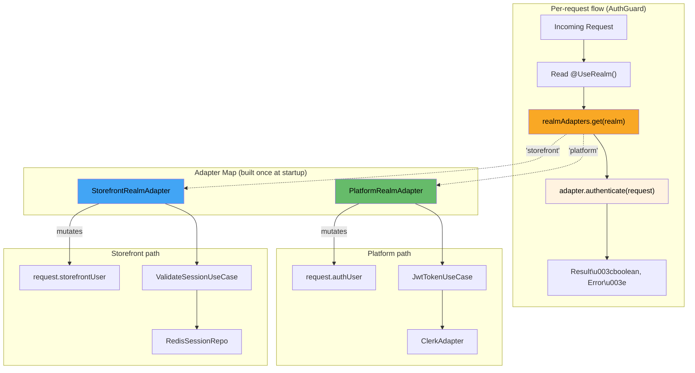

# Ferrite Auth Module

The `auth` module provides a global, realm-based authentication system. It uses an **adapter-based dynamic dispatch** pattern to securely route incoming requests to the appropriate authentication mechanism (e.g., Clerk JWTs for admins, Redis sessions for customers) without polluting the global `AuthGuard` with domain-specific logic.

## Core Concepts

The architecture relies on three primary concepts:

1. **Explicit Realms (`@UseRealm`)**: Controllers explicitly declare which authentication realm they belong to.
2. **Dynamic Swapping**: The global `AuthGuard` dynamically selects the right adapter for the request based on the realm.
3. **Dual Controllers**: Features are split into two separate controllers (Platform vs. Storefront) rather than mixing auth concerns in a single controller.

### The Two Realms

| Realm | Auth Mechanism | Target Audience | Request Identity |
|---|---|---|---|
| `platform` | Clerk JWT (Bearer token) | Store Admins, App Owners | `request.authUser` |
| `storefront` | Redis Session (Cookie) | Store Customers | `request.storefrontUser` |

---

## 1. Explicit Routing and Dual Controllers

To keep auth strict and explicit, we use **Dual Controllers** for store features. A feature does not have one controller that handles both admins and customers. Instead, it has two:

- A **Storefront Controller** handling customer operations (e.g., `POST /stores/:storeId/cart`).
- A **Platform Controller** handling admin operations (e.g., `POST /stores/:storeId/admin/products`).

You decorate the **entire controller class** with `@UseRealm()`. Every route within that controller inherits the realm.

```typescript
// 1. Platform Controller (Admin)
@UseRealm('platform')
@Controller('stores/:storeId/admin/products')
export class AdminProductController {
  @Post()
  async createProduct(@Req() req: PlatformAuthenticatedRequest) {
    const admin = req.authUser; // Strongly typed platform identity
  }
}

// 2. Storefront Controller (Customer)
@UseRealm('storefront')
@Controller('stores/:storeId/products')
export class StorefrontProductController {
  @Get()
  async listProducts(@Req() req: StorefrontAuthenticatedRequest) {
    const customer = req.storefrontUser; // Strongly typed storefront identity
  }
}
```

### Auto-Discovery and Fail-Fast Safety

To prevent security misconfigurations, the `RealmDiscoveryService` runs at boot-time and strictly enforces path conventions. It will **crash the application on startup** if it detects a mismatch:

- ❌ `@UseRealm('storefront')` on a controller containing `/admin` in its path.
- ❌ `@UseRealm('platform')` on a `stores/` path that *does not* include `/admin`.
- ❌ A controller declaring a realm that has no registered adapter.

---

## 2. Dynamic Adapter Swapping

The global `AuthGuard` (registered via `APP_GUARD`) is remarkably simple. It has **zero realm-specific if/else branching**. Instead, it dynamically swaps the authentication adapter.



1. The guard reads the `@UseRealm()` metadata from the controller.
2. It retrieves the matching adapter from the `REALM_ADAPTER_MAP`.
3. It calls `adapter.authenticate(request)`.

If the adapter returns `Ok(true)`, the request proceeds. If it returns `Err(error)`, the guard throws a 401 `UnauthorizedException`.

---

## 3. How to Implement a New Realm Adapter

Adding a new authentication realm (e.g., `service-to-service` API keys) requires zero changes to the `AuthGuard`.

### Step 1: Define the Realm

Add your new realm to the `AuthRealm` union type in `use-realm.decorator.ts`.

```typescript
export type AuthRealm = 'platform' | 'storefront' | 's2s';
```

### Step 2: Implement the Adapter Interface

Create a new adapter implementing `IRealmAuthAdapter`. This adapter is responsible for extracting credentials (headers, cookies), validating them via your use cases, and attaching the identity to the Fastify `Request`.

```typescript
@Injectable()
export class S2SRealmAdapter implements IRealmAuthAdapter {
  constructor(private readonly verifyApiKey: VerifyApiKeyUseCase) {}

  async authenticate(request: Request): Promise<Result<boolean, Error>> {
    const apiKey = request.headers['x-api-key'];
    if (!apiKey) return err(new Error('Missing API Key'));

    const result = await this.verifyApiKey.execute(apiKey);
    if (result.isErr()) return err(result.error);

    // Attach identity to the request
    (request as any).serviceAccount = result.value;
    (request as any).__authRealm = 's2s';
    
    return ok(true);
  }
}
```

### Step 3: Register in the Map

Provide the new adapter and add it to the `REALM_ADAPTER_MAP` in `auth.module.ts`:

```typescript
@Module({
  providers: [
    // ... existing adapters
    S2SRealmAdapter,
    {
      provide: REALM_ADAPTER_MAP,
      useFactory: (
        platform: PlatformRealmAdapter,
        storefront: StorefrontRealmAdapter,
        s2s: S2SRealmAdapter // Inject it here
      ) => new Map([
        ['platform', platform],
        ['storefront', storefront],
        ['s2s', s2s],        // Map the realm key to the instance
      ]),
      inject: [PlatformRealmAdapter, StorefrontRealmAdapter, S2SRealmAdapter],
    }
  ]
})
```

Now you can protect any controller by simply adding `@UseRealm('s2s')`.

---

## Skipping Authentication

If a controller is decorated with a realm, but a specific route inside it needs to bypass authentication (e.g., a login or webhook endpoint), use the `@PublicRoute()` or `@WebhookRoute()` decorators on the method:

```typescript
@UseRealm('storefront')
@Controller('stores/:storeId/auth')
export class StorefrontAuthController {
  
  @Post('login')
  @PublicRoute() // Bypasses the storefront session check
  async login() { ... }
  
  @Get('sessions')
  // No @PublicRoute() -> Guard ensures session cookie is valid
  async getSessions() { ... }
}
```
